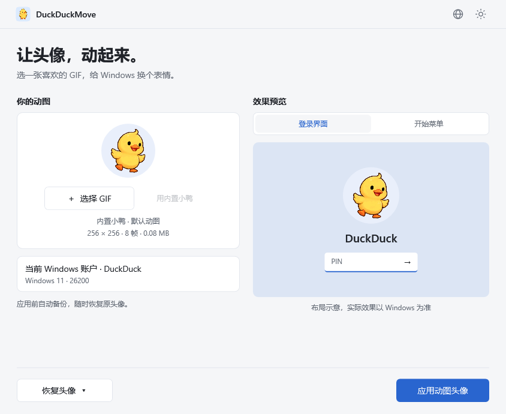
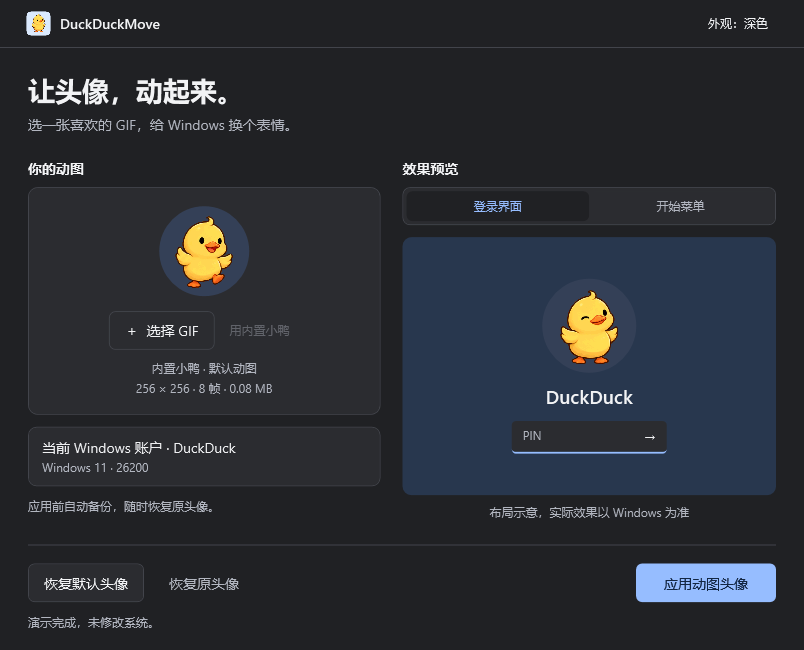
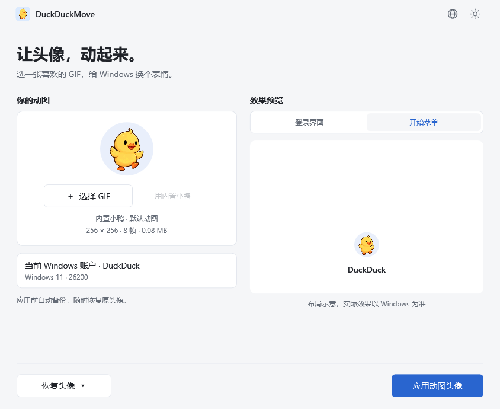

# DuckDuckMove

[简体中文](README.md) · [繁體中文](README.zh-TW.md) · [English](README.en.md) · [日本語](README.ja.md) · [Español](README.es.md) · [Português](README.pt.md)

<p align="center"></p>

**Bring your avatar to life.** A Windows 11 animated avatar tool with a built-in duck GIF, local processing and a reset to the Windows default avatar.

[Download releases](https://github.com/wooi/DuckDuckMove/releases) · [Report an issue](https://github.com/wooi/DuckDuckMove/issues)

## Download

The current source is **v0.1.3**, with six interface languages and automatic Start menu reload after applying or resetting an avatar. The public **v0.1.1 test release does not include these changes**. Microsoft account card synchronization is not supported. See [Start menu notes](docs/START-MENU.md).

Open a release and choose a file under **Assets**:

| Package | File | How to use |
| --- | --- | --- |
| Installer | `DuckDuckMove-0.1.1-x64.msi` | Install, then open from Start. Optional desktop shortcut and Windows uninstall support. |
| Portable | `DuckDuckMove-0.1.1-win-x64.zip` | Extract and run `DuckDuckMove.exe`. |

Both require **Windows 11 x64** and include the .NET runtime. Applying or resetting an avatar requires administrator approval. The portable app still saves avatar assets and backups to the system data folder. Files are unsigned test builds. Compatibility across accounts and Windows versions remains under verification. GitHub's **Source code** archives contain source, not the runnable app.

## Preview

These screenshots are rendered from the actual WPF app in demo mode. The right panel is a layout illustration, not a capture of the Windows sign-in screen. Screenshots may show the Chinese interface; the app language is selectable.



<details><summary>Dark interface and Start layout</summary>




</details>


## Use

1. Run `DuckDuckMove.exe`; no separate .NET installation is needed.
2. Use the built-in duck, choose a GIF or drop one into the app. Preview the sign-in or Start layout.
3. Click **Apply avatar** and approve the Windows administrator prompt.
4. The app backs up the original avatar, saves the GIF and changes the current user's local avatar configuration. Check the result in Windows.

Click **Use duck** to return to the built-in image. The GIF is embedded in the EXE and also provided in `samples/duckduckmove-duck.gif`. The icon uses its first frame on a pale blue rounded square, with 16–256 px ICO sizes; the avatar itself remains transparent.

Click the **globe icon** to choose 简体中文, 繁體中文, English, 日本語, Español or Português. By default, the app follows the Windows display language. Manual choices apply immediately and are remembered; unsupported system languages fall back to English. See [language support](docs/LANGUAGES.md). Windows prompts and system diagnostic text follow Windows settings; the MSI wizard remains Chinese.

**Reset to default** restores the Windows silhouette. The current UI only offers this reset; original backups remain for recovery after failed operations. The footer shows only reset and apply actions, with status text when an operation is in progress, completed or failed.

Since v0.1.2, successful apply/reset operations automatically reload the Start menu. The menu may briefly close. A reload failure does not undo the saved avatar and does not imply that the Microsoft account card will update. The app does not automatically sign out, reboot or lock the PC. You may close it after completion; its temporary service exits and is removed.

## Limits, data and permissions

- Only the current Windows user's local avatar is changed, not the cloud Microsoft account picture. Other architectures are not packaged or verified.
- GIF limits: 20 MB, dimensions up to 2048 × 2048, at most 500 frames and 120 million total logical frame pixels. Static, damaged or oversized GIFs are rejected.
- Preview uses a circular crop; the source GIF is not cropped or re-encoded. Windows rendering may differ.
- This edits Windows avatar registry configuration; it is not a Microsoft-guaranteed animated-avatar API. Updates, account synchronization or selecting a picture in Settings may overwrite it. Read-back verification does not prove animation is playing everywhere. Organization policy requiring the default avatar blocks application.

Assets, first backups, recovery records, operation results and helper binaries live in `%ProgramData%\DuckDuckMove`. GIFs are not uploaded. Preview copies in `%LocalAppData%\DuckDuckMove\Preview` are cleaned on normal exit. Language preferences live in `%LocalAppData%\DuckDuckMove\preferences.json`.

The UI runs without elevation. For writes, an elevated helper copies the standalone EXE to a protected folder and creates a one-time SYSTEM service for restricted avatar operations on the initiating user. It does not change registry permissions.

## Verification

21 core tests pass, covering backup retention, missing keys, reset, rollback, recovery, read-back verification and invalid GIFs. Hidden UI tests cover animation, interactions and all six language choices, matching, persistence and corrupt-preference fallback. Light/dark and Start layouts have been reviewed.

The v0.1.1 MSI passed silent install/uninstall, payload and shortcut checks, and installed-app UI tests; later installers have not completed equivalent real installation testing. User feedback reports lock-screen updates and a Start avatar update after reboot, while the Microsoft account card stayed unchanged. **Automatic visual refresh, local-only accounts and complete flows across Windows versions still require verification.** Hidden UI tests do not modify real avatars.

## Build

Use Windows, .NET 10 SDK and PowerShell 7:

```powershell
./tools/build.ps1
./tools/build-msi.ps1
```

The first script tests and publishes a portable ZIP; the second builds an MSI using Windows tools. For individual steps:

```powershell
dotnet run --project tests/DuckDuckMove.Tests/DuckDuckMove.Tests.csproj -c Release
dotnet publish src/DuckDuckMove.App/DuckDuckMove.App.csproj -c Release -r win-x64 -o dist/win-x64
.\dist\win-x64\DuckDuckMove.exe --demo
.\dist\win-x64\DuckDuckMove.exe --render artifacts/ui samples/orbit.gif
```

System operations require the published standalone EXE; multi-file debug builds are for UI development. `tools/create-demo.py` generates the old placeholder assets. The duck was AI-generated, encoded by `tools/SpriteToGif`, and its icon made by `tools/DuckIcon`. See the [asset prompt and process](samples/source/image-prompt.md).

## Credits and license

The implementation was informed by 克莱德's SSPAI article [《一日一技｜我的 Windows 11 头像会动，你也可以》](https://sspai.com/post/114312). The article credits [@Patrosi73](https://x.com/Patrosi73)'s [post](https://x.com/Patrosi73/status/2096652760494088376) as its inspiration and adds tool-configuration details. Thank you to Patrosi73, 克莱德 and SSPAI. DuckDuckMove adds a GUI, backups, default reset, automatic reload and language selection.

Source code is licensed under [MIT](LICENSE). .NET/WPF and System.ServiceProcess.ServiceController notices are in [third-party](third-party). [XamlAnimatedGif](https://github.com/XamlAnimatedGif/XamlAnimatedGif) 2.3.2 by Thomas Levesque uses Apache-2.0. Third-party licenses are included in distributions. The built-in duck is AI-generated.

## Uninstall and contribute

Uninstall the MSI through Windows Settings → Apps → Installed apps, or delete the extracted portable folder. Avatar assets and backups are retained so saved paths remain valid. Reset the avatar before uninstalling if desired; to remove all data, reset first, then have an administrator remove only the app's own data folder.

Issues are welcome with your Windows version, reproduction steps and error message. Do not upload full logs containing account SIDs or private paths. See [architecture](docs/ARCHITECTURE.md).
