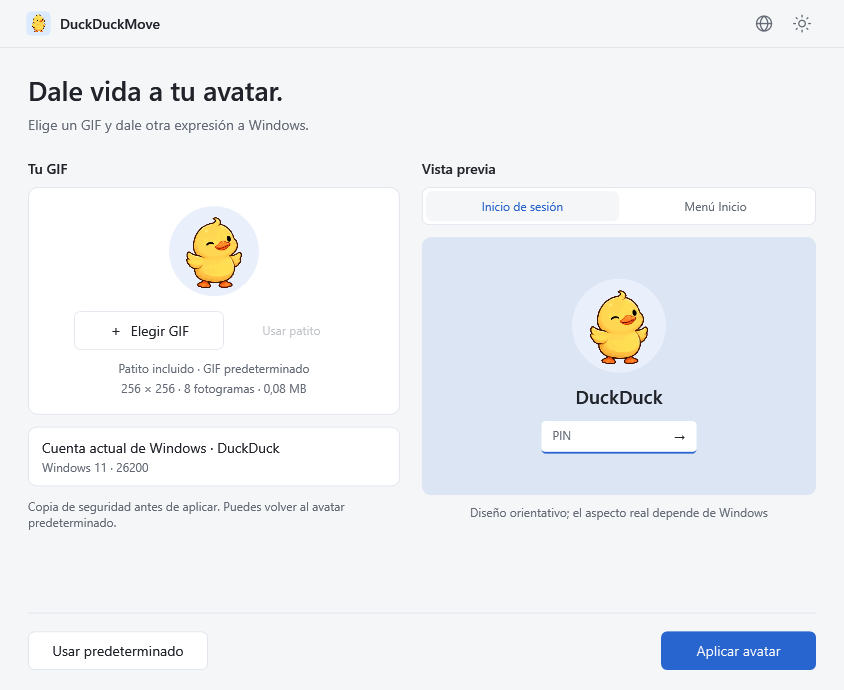
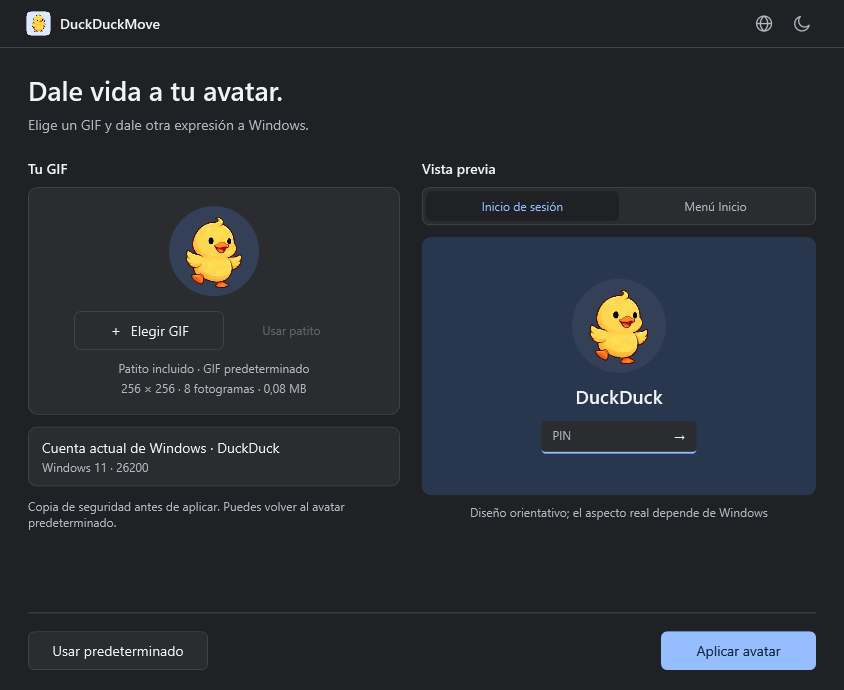
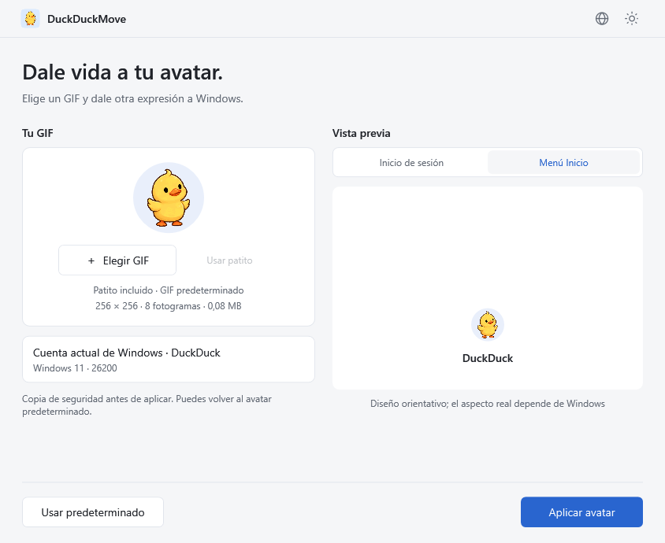

# DuckDuckMove

[简体中文](README.md) · [繁體中文](README.zh-TW.md) · [English](README.en.md) · [日本語](README.ja.md) · [Español](README.es.md) · [Português](README.pt.md)

<p align="center"></p>

**Dale vida a tu avatar.** Avatares animados para Windows 11, con un patito GIF incluido, procesamiento local y opción de volver al avatar predeterminado de Windows.

[Descargar versiones](https://github.com/wooi/DuckDuckMove/releases) · [Informar de un problema](https://github.com/wooi/DuckDuckMove/issues)

## Descarga

El código actual es **v0.1.3**, con seis idiomas y recarga automática del menú Inicio después de aplicar o restablecer el avatar. **La versión pública de prueba v0.1.1 no incluye estas mejoras.** No se admite la sincronización de la tarjeta de cuenta Microsoft. Consulta las [notas sobre Inicio](docs/START-MENU.md).

En la página de la versión, elige un archivo en **Assets**:

| Paquete | Archivo | Uso |
| --- | --- | --- |
| Instalador | `DuckDuckMove-0.1.1-x64.msi` | Instala y abre desde Inicio. Acceso directo de escritorio opcional y desinstalación desde Windows. |
| Portátil | `DuckDuckMove-0.1.1-win-x64.zip` | Extrae y ejecuta `DuckDuckMove.exe`. |

Ambos requieren **Windows 11 x64** e incluyen .NET. Aplicar o restablecer requiere autorización de administrador. La versión portátil también guarda imágenes y copias en la carpeta de datos del sistema. Son versiones de prueba sin firma de código; la compatibilidad entre cuentas y versiones de Windows sigue en evaluación. Los archivos **Source code** de GitHub contienen código fuente, no la aplicación ejecutable.

## Vista previa

Capturas generadas con la aplicación WPF real en modo de demostración. El panel derecho ilustra el diseño, no es una captura de la pantalla de inicio de sesión de Windows. Las capturas siguientes muestran la interfaz en español.



<details><summary>Interfaz oscura y diseño de Inicio</summary>




</details>


## Uso

1. Ejecuta `DuckDuckMove.exe`; no necesitas instalar .NET por separado.
2. Usa el patito incluido, elige un GIF o arrástralo a la aplicación. Consulta el diseño de inicio de sesión o del menú Inicio.
3. Pulsa **Aplicar avatar** y acepta la solicitud de administrador de Windows.
4. La aplicación guarda una copia del avatar original, almacena el GIF y modifica la configuración local del usuario actual. Comprueba el resultado en Windows.

**Usar patito** vuelve al GIF incluido. Está integrado en el EXE y también se proporciona como `samples/duckduckmove-duck.gif`. El icono usa su primer fotograma sobre un cuadrado azul claro con esquinas redondeadas, en tamaños ICO de 16 a 256 píxeles. El GIF del avatar sigue siendo transparente.

El **icono del globo** permite elegir 简体中文, 繁體中文, English, 日本語, Español o Português. Por defecto se sigue el idioma de pantalla de Windows. La selección manual se aplica al instante y se recuerda; si el idioma del sistema no está disponible, se usa inglés. Consulta [idiomas](docs/LANGUAGES.md). Las ventanas de autorización y los diagnósticos originales del sistema siguen la configuración de Windows. El asistente MSI sigue en chino.

**Usar predeterminado** restaura la silueta de Windows. Es la única opción de restauración de avatar de la interfaz actual; la copia original se conserva para recuperar operaciones fallidas. Abajo solo aparecen restablecer y aplicar; el estado se muestra durante la operación, al completarla o si falla.

Desde v0.1.2, las operaciones correctas recargan Inicio automáticamente y el menú puede cerrarse brevemente. Un fallo de recarga no deshace el avatar guardado ni implica que se actualice la tarjeta Microsoft. La aplicación no cierra sesión, reinicia ni bloquea el PC automáticamente. Al terminar puedes cerrarla; el servicio temporal finaliza y se elimina.

## Límites, datos y permisos

- Solo cambia el avatar local del usuario actual de Windows, no la imagen de la cuenta Microsoft en la nube. No se han empaquetado ni verificado otras arquitecturas.
- GIF: hasta 20 MB, 2048 × 2048 píxeles, 500 fotogramas y 120 millones de píxeles lógicos totales de fotogramas. Se rechazan archivos estáticos, dañados o demasiado grandes.
- La vista previa es circular; el GIF original no se recorta ni recodifica. Windows puede mostrarlo de otra forma.
- Se modifica la configuración del avatar en el registro; no es una API de avatares animados con compatibilidad garantizada por Microsoft. Las actualizaciones, la sincronización o cambiar la foto desde Configuración pueden sobrescribirla. Verificar la lectura no garantiza que la animación se reproduzca en todos los lugares. Una política que exija el avatar predeterminado impide aplicarlo.

Imágenes, primera copia de seguridad, registros de recuperación, resultados y asistentes se guardan en `%ProgramData%\DuckDuckMove`. Los GIF no se suben a Internet. Las copias de `%LocalAppData%\DuckDuckMove\Preview` se borran al cerrar normalmente. El idioma se guarda en `%LocalAppData%\DuckDuckMove\preferences.json`.

La interfaz funciona sin elevación. Para escribir, un asistente elevado copia el EXE a una carpeta protegida y crea un servicio SYSTEM de un solo uso para operaciones limitadas del usuario que las inició. No modifica los permisos del registro.

## Verificación

Pasan 21 pruebas del núcleo: conservación de copias, claves ausentes, restablecimiento, reversión, recuperación, verificación de lectura y GIF no válidos. Las pruebas de interfaz oculta cubren animación, acciones, seis idiomas, correspondencia con el sistema, persistencia y recuperación de preferencias dañadas. Se revisaron los diseños claro, oscuro y de Inicio.

El MSI v0.1.1 pasó pruebas de instalación y desinstalación silenciosas, archivos, accesos directos e interfaz instalada. Los instaladores posteriores aún no han completado pruebas reales equivalentes. Un usuario informó de actualizaciones en la pantalla de bloqueo y del avatar inferior de Inicio tras reiniciar; la tarjeta Microsoft no cambió. **Queda por verificar el refresco visual automático, las cuentas exclusivamente locales y el flujo completo en distintas versiones de Windows.** Las pruebas ocultas no cambian avatares reales.

## Compilación

Usa Windows, .NET 10 SDK y PowerShell 7:

```powershell
./tools/build.ps1
./tools/build-msi.ps1
```

El primer script prueba y crea el ZIP portátil; el segundo crea un MSI con herramientas de Windows. También puedes ejecutar:

```powershell
dotnet run --project tests/DuckDuckMove.Tests/DuckDuckMove.Tests.csproj -c Release
dotnet publish src/DuckDuckMove.App/DuckDuckMove.App.csproj -c Release -r win-x64 -o dist/win-x64
.\dist\win-x64\DuckDuckMove.exe --demo
.\dist\win-x64\DuckDuckMove.exe --render artifacts/ui samples/orbit.gif
```

Las operaciones del sistema requieren el EXE independiente publicado; las compilaciones de depuración con varios archivos son para desarrollar la interfaz. `tools/create-demo.py` genera los antiguos recursos provisionales. El patito se generó con IA, se codificó con `tools/SpriteToGif` y su icono se creó con `tools/DuckIcon`. Consulta el [prompt y proceso](samples/source/image-prompt.md).

## Créditos y licencia

La implementación se inspiró en el artículo de 克莱德 en SSPAI, [《一日一技｜我的 Windows 11 头像会动，你也可以》](https://sspai.com/post/114312). El artículo atribuye su inspiración a la [publicación](https://x.com/Patrosi73/status/2096652760494088376) de [@Patrosi73](https://x.com/Patrosi73) y añade detalles de configuración. Gracias a Patrosi73, 克莱德 y SSPAI. DuckDuckMove incorpora una interfaz gráfica, copias, restablecimiento, recarga automática y selección de idiomas.

El código usa la licencia [MIT](LICENSE). Los avisos de .NET/WPF y System.ServiceProcess.ServiceController están en [third-party](third-party). [XamlAnimatedGif](https://github.com/XamlAnimatedGif/XamlAnimatedGif) 2.3.2 de Thomas Levesque usa Apache-2.0. Las licencias de terceros se incluyen en los paquetes. El patito es un recurso generado con IA.

## Desinstalar y contribuir

Desinstala el MSI desde Configuración → Aplicaciones → Aplicaciones instaladas, o elimina la carpeta portátil. Se conservan imágenes y copias para no invalidar sus rutas. Si quieres restablecer el avatar, hazlo antes de desinstalar. Para borrar todos los datos, restablece primero y después elimina, con permisos de administrador, únicamente la carpeta de esta aplicación.

Puedes enviar Issues con la versión de Windows, los pasos para reproducir el problema y el mensaje de error. No subas registros completos con SID de cuenta o rutas privadas. Consulta la [arquitectura](docs/ARCHITECTURE.md).
