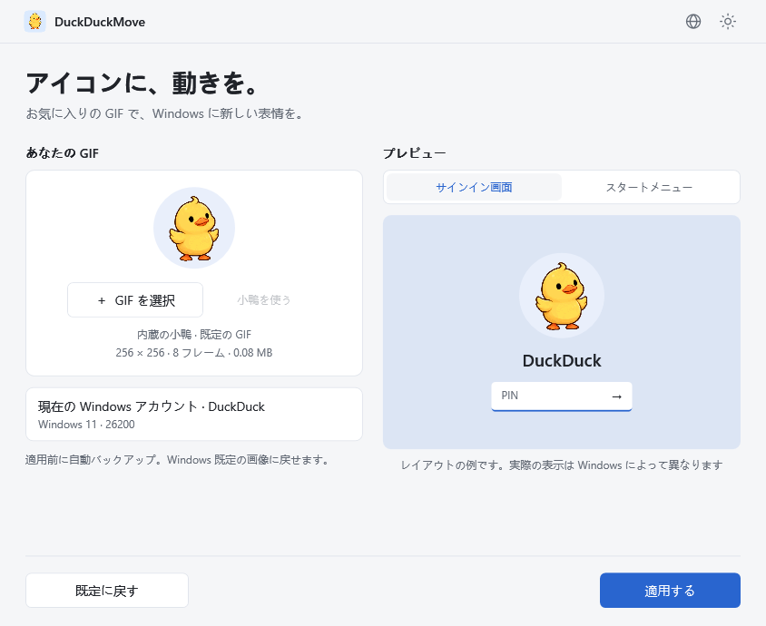
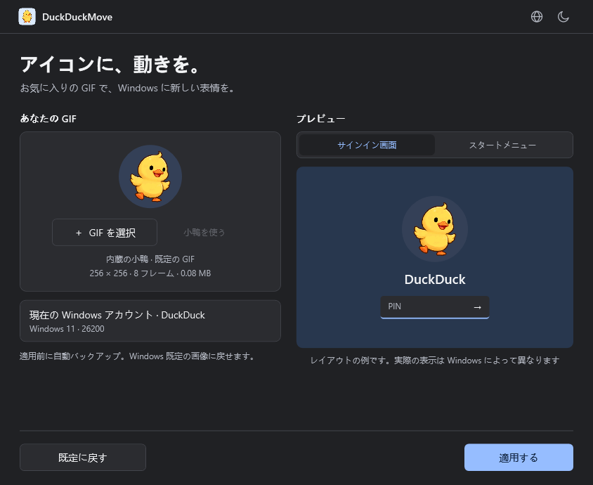
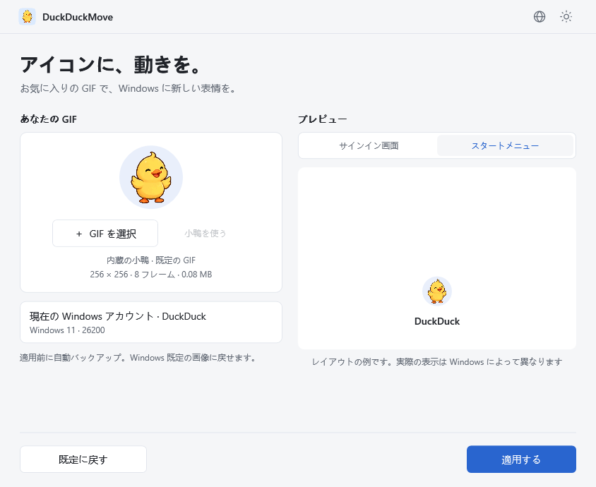

# DuckDuckMove

[English](README.md) · [简体中文](README.zh-CN.md) · [繁體中文](README.zh-TW.md) · [日本語](README.ja.md) · [Español](README.es.md) · [Português](README.pt.md)

<p align="center"></p>

**アイコンに、動きを。** Windows 11 のアカウント画像に GIF を設定するツールです。小鴨の GIF を内蔵し、ローカルで処理します。Windows 既定の画像に戻すこともできます。

[リリースをダウンロード](https://github.com/wooi/DuckDuckMove/releases) · [問題を報告](https://github.com/wooi/DuckDuckMove/issues)

## ダウンロード

現在のリリースは **v0.1.3 プレビュー版** です。6 言語の UI と、適用・リセット後のスタートメニュー自動再読み込みを含みます。Microsoft アカウントカードの画像同期には対応していません。[再読み込みについて](docs/START-MENU.md)もご覧ください。

リリースページの **Assets** から選んでください。

| 種類 | ファイル | 使い方 |
| --- | --- | --- |
| インストーラー | `DuckDuckMove-0.1.3-x64.msi` | インストール後、スタートメニューから起動。デスクトップショートカットは任意で、Windows からアンインストール可能です。 |
| ポータブル版 | `DuckDuckMove-0.1.3-win-x64.zip` | 展開して `DuckDuckMove.exe` を実行します。 |

**Windows 11 x64** が必要です。どちらも .NET ランタイムを同梱しています。画像の適用・リセットには管理者の承認が必要です。ポータブル版も画像とバックアップをシステムのデータフォルダーに保存します。配布ファイルは未署名のテスト版であり、アカウントや Windows バージョンごとの互換性は検証中です。GitHub の **Source code** はソースコードで、実行用アプリではありません。

## 実際の動作

実際の Windows 画面です。ユーザー名にはぼかしを入れています。ロック／サインイン画面はスマートフォンで撮影し、スタートメニューは画面録画しました。この PC での動作例であり、すべての Windows バージョンや Microsoft アカウントカードでの対応を示すものではありません。

### ロック／サインイン画面


### スタートメニュー


## プレビュー

実際の WPF アプリをデモモードで描画した画像です。右側はレイアウトの例で、Windows サインイン画面の実機キャプチャではありません。以下は日本語のインターフェイスです。



<details><summary>ダーク表示とスタートメニューのレイアウト</summary>




</details>


## 使い方

1. `DuckDuckMove.exe` を起動します。.NET の別途インストールは不要です。
2. 内蔵の小鴨を使うか、GIF を選択・ドロップします。サインイン画面とスタートメニューのレイアウトを確認できます。
3. **適用する** を押し、Windows の管理者承認に応答します。
4. 元の画像をバックアップし、GIF を保存して、現在のユーザーのローカル画像設定を変更します。Windows で実際の表示を確認してください。

**小鴨を使う** で内蔵 GIF に戻せます。GIF は EXE に内蔵され、`samples/duckduckmove-duck.gif` としても同梱されています。アプリのアイコンは最初のフレームに淡い青色の角丸背景を付けたもので、16～256 ピクセルの ICO を含みます。アカウント画像用 GIF の背景は透明です。

右上の **地球アイコン** から、简体中文、繁體中文、English、日本語、Español、Português を選べます。初期設定では Windows の表示言語に従い、未対応の言語は英語になります。手動選択はすぐに反映され、次回も保持されます。[言語の詳細](docs/LANGUAGES.md)。Windows の承認画面やシステム診断の原文は Windows の設定に従います。MSI のインストール画面は現在、中国語です。

**既定に戻す** は Windows 標準の人物画像に戻します。現在の UI の復元機能はこれのみです。元の画像のバックアップは、操作失敗時の復元用に保持されます。下部にはリセットと適用の 2 操作のみを表示し、処理中・完了・エラー時に状態を表示します。

v0.1.2 以降では適用・リセット成功後にスタートメニューを自動再読み込みするため、一時的に閉じる場合があります。再読み込みに失敗しても保存済みの画像を取り消しません。また、Microsoft アカウントカードの更新を保証しません。自動でサインアウト、再起動、ロックは行いません。処理後はアプリを閉じられ、一時サービスは終了して削除されます。

## 制限とデータ

- 変更対象は現在の Windows ユーザーのローカル画像のみで、クラウドの Microsoft アカウント画像は変更しません。他の CPU アーキテクチャは未検証です。
- GIF は 20 MB 以下、幅・高さ各 2048 ピクセル以下、500 フレーム以下、総論理フレーム画素数 1 億 2000 万以下です。静止画、破損ファイル、制限超過ファイルは拒否します。
- プレビューは円形ですが、元の GIF は切り抜き・再エンコードしません。実際の表示は異なる場合があります。
- Windows の画像レジストリ設定を変更する方式で、Microsoft が互換性を保証する動画アイコン API ではありません。システム更新、アカウント同期、設定画面での画像変更により上書きされる場合があります。読み戻し検証は、全画面でのアニメーション再生を保証しません。組織のポリシーで既定画像が強制される場合、適用はブロックされます。

画像、初回バックアップ、復元記録、操作結果、補助プログラムは `%ProgramData%\DuckDuckMove` に保存します。GIF はアップロードしません。`%LocalAppData%\DuckDuckMove\Preview` のプレビューは正常終了時に削除します。言語設定は `%LocalAppData%\DuckDuckMove\preferences.json` に保存します。

UI は通常権限で動作します。書き込み時には管理者権限の補助プログラムが単体 EXE を保護された場所にコピーし、一度限りの SYSTEM サービスを作成します。開始ユーザーの限定された画像操作のみを行い、レジストリのアクセス権は変更しません。

## 検証状況

バックアップ、欠落キー、リセット、ロールバック、復元、読み戻し、無効 GIF などのコアテスト 21 件が成功しています。非表示 UI テストでアニメーション、操作、6 言語の選択・照合・保存・破損設定からの復帰を確認し、ライト・ダーク・スタート画面のレイアウトも確認しました。

v0.1.1 MSI のサイレントインストール・アンインストール、ファイル・ショートカット、インストール後 UI のテストは成功しています。後続のインストーラーは同等の実機検証を完了していません。ユーザーからは、ロック画面は更新され、スタート下部の画像は再起動後に更新される一方、Microsoft アカウントカードは変わらないとの報告があります。**自動再読み込み後の表示、ローカル専用アカウント、Windows 各バージョンでの一連の動作は引き続き検証が必要です。** 非表示 UI テストは実際の画像設定を変更しません。

## ビルド

Windows、.NET 10 SDK、PowerShell 7 を使用します。

```powershell
./tools/build.ps1
./tools/build-msi.ps1
```

最初のスクリプトはテストとポータブル ZIP の作成、次は Windows のツールによる MSI の作成を行います。個別に実行する場合：

```powershell
dotnet run --project tests/DuckDuckMove.Tests/DuckDuckMove.Tests.csproj -c Release
dotnet publish src/DuckDuckMove.App/DuckDuckMove.App.csproj -c Release -r win-x64 -o dist/win-x64
.\dist\win-x64\DuckDuckMove.exe --demo
.\dist\win-x64\DuckDuckMove.exe --render artifacts/ui samples/orbit.gif
```

システム操作には発行済みの単体 EXE を使用してください。複数ファイルのデバッグ版は UI 開発用です。`tools/create-demo.py` は旧仮素材を作成します。小鴨は AI で生成し、`tools/SpriteToGif` で GIF 化、`tools/DuckIcon` でアイコン化しました。[素材のプロンプトと工程](samples/source/image-prompt.md)を参照してください。

## 謝辞・ライセンス

実装は、克莱德による少数派の記事 [《一日一技｜我的 Windows 11 头像会动，你也可以》](https://sspai.com/post/114312) を参考にしています。記事は [@Patrosi73](https://x.com/Patrosi73) の [投稿](https://x.com/Patrosi73/status/2096652760494088376) に着想を得たことを明記し、ツール設定を補足しています。Patrosi73、克莱德、少数派に感謝します。DuckDuckMove は GUI、バックアップ、既定画像へのリセット、自動再読み込み、多言語対応を追加しました。

ソースコードは [MIT](LICENSE) です。.NET/WPF と System.ServiceProcess.ServiceController のライセンスは [third-party](third-party) を参照してください。Thomas Levesque の [XamlAnimatedGif](https://github.com/XamlAnimatedGif/XamlAnimatedGif) 2.3.2 は Apache-2.0 です。第三者ライセンスは配布物に同梱されます。内蔵の小鴨は AI 生成素材です。

## アンインストールと貢献

MSI 版は Windows の「設定 → アプリ → インストールされているアプリ」から、ポータブル版は展開フォルダーの削除で取り除けます。画像の参照先を壊さないよう、素材とバックアップは残します。必要なら先に既定画像へ戻してください。全データを削除する場合は、リセット後、管理者が本アプリのデータフォルダーのみを削除します。

Issues には Windows バージョン、再現手順、エラーメッセージを添えてください。アカウント SID や個人のパスを含むログ全体はアップロードしないでください。[設計資料](docs/ARCHITECTURE.md)も参照できます。
