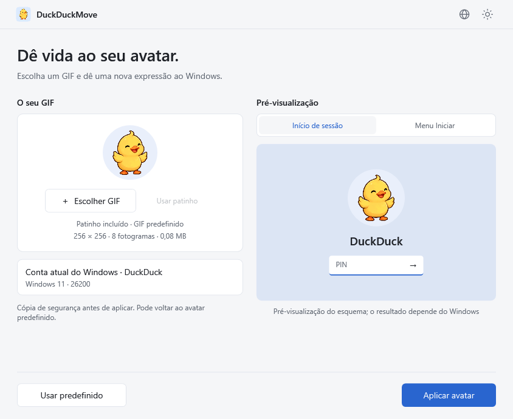
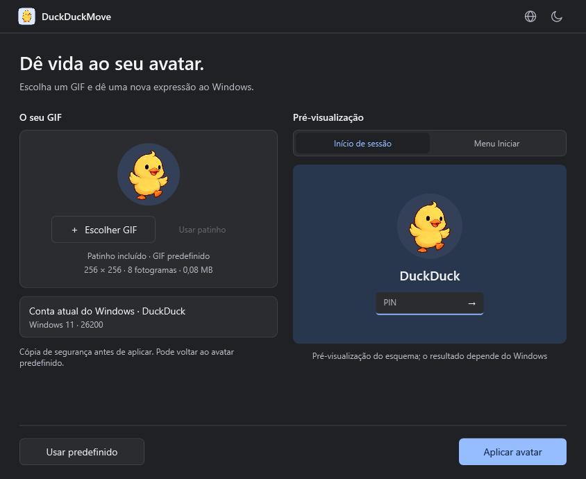
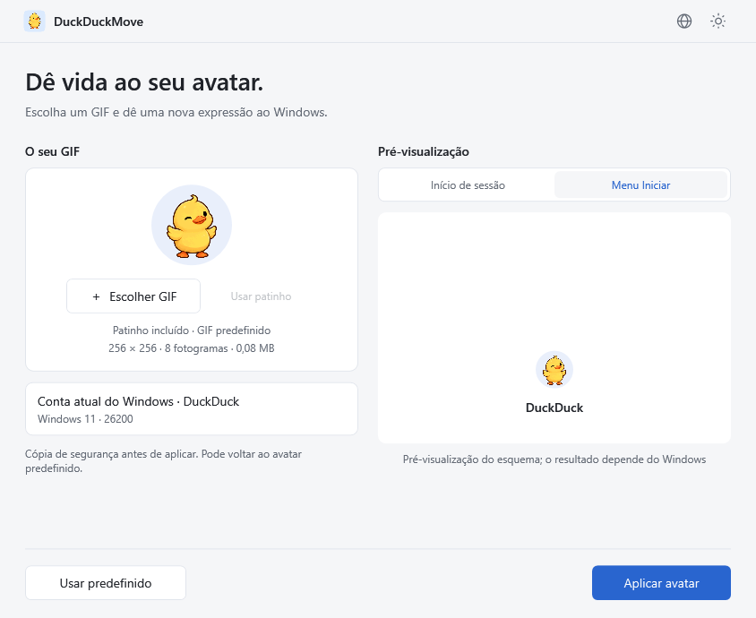

# DuckDuckMove

[English](README.md) · [简体中文](README.zh-CN.md) · [繁體中文](README.zh-TW.md) · [日本語](README.ja.md) · [Español](README.es.md) · [Português](README.pt.md)

<p align="center"></p>

**Dê vida ao seu avatar.** Avatares animados para Windows 11, com um GIF de patinho incluído, processamento local e reposição do avatar predefinido do Windows.

[Descarregar versões](https://github.com/wooi/DuckDuckMove/releases) · [Comunicar um problema](https://github.com/wooi/DuckDuckMove/issues)

## Transferência

A versão atual é **v0.1.3 (de teste)**, com seis idiomas e recarga automática do menu Iniciar após aplicar ou repor o avatar. A sincronização do cartão da conta Microsoft não é suportada. Consulte as [notas sobre o menu Iniciar](docs/START-MENU.md).

Na página da versão, escolha um ficheiro em **Assets**:

| Pacote | Ficheiro | Utilização |
| --- | --- | --- |
| Instalador | `DuckDuckMove-0.1.3-x64.msi` | Instale e abra pelo menu Iniciar. Atalho de ambiente de trabalho opcional e desinstalação pelo Windows. |
| Portátil | `DuckDuckMove-0.1.3-win-x64.zip` | Extraia e execute `DuckDuckMove.exe`. |

Ambos requerem **Windows 11 x64** e incluem o runtime .NET. Aplicar ou repor o avatar requer autorização de administrador. A versão portátil também guarda imagens e cópias na pasta de dados do sistema. Os pacotes são versões de teste sem assinatura de código; a compatibilidade entre contas e versões do Windows continua em verificação. Os arquivos **Source code** do GitHub contêm código-fonte, não a aplicação executável.

## Em ação

Gravações reais do Windows com os nomes de utilizador desfocados. O ecrã de início de sessão foi filmado com um telemóvel; o menu Iniciar foi gravado diretamente. Mostram o resultado neste PC, não a compatibilidade com todas as versões do Windows nem com o cartão da conta Microsoft.

### Ecrã de bloqueio / início de sessão


### Menu Iniciar


## Pré-visualização

Imagens geradas pela aplicação WPF real em modo de demonstração. O painel da direita ilustra o esquema; não é uma captura do ecrã de início de sessão do Windows. As capturas abaixo mostram a interface em português.



<details><summary>Interface escura e esquema do menu Iniciar</summary>




</details>


## Utilização

1. Execute `DuckDuckMove.exe`; não é necessário instalar o .NET separadamente.
2. Use o patinho incluído, escolha um GIF ou arraste-o para a aplicação. Veja o esquema de início de sessão ou do menu Iniciar.
3. Clique em **Aplicar avatar** e confirme o pedido de administrador do Windows.
4. A aplicação faz uma cópia do avatar original, guarda o GIF e altera as definições locais do utilizador atual. Verifique o resultado no Windows.

**Usar patinho** volta ao GIF incluído. Está incorporado no EXE e também disponível em `samples/duckduckmove-duck.gif`. O ícone usa o primeiro fotograma sobre um quadrado azul-claro com cantos arredondados, em tamanhos ICO de 16 a 256 píxeis. O GIF do avatar mantém o fundo transparente.

O **ícone do globo** permite escolher 简体中文, 繁體中文, English, 日本語, Español ou Português. Por predefinição, segue o idioma de apresentação do Windows. A seleção manual é imediata e fica guardada; idiomas do sistema não suportados usam inglês. Consulte os [idiomas](docs/LANGUAGES.md). As janelas de autorização e o texto original dos diagnósticos seguem as definições do Windows. O assistente MSI continua em chinês.

**Usar predefinido** repõe a silhueta do Windows. É a única opção de reposição do avatar na interface atual; a cópia original mantém-se para recuperar operações falhadas. A parte inferior mostra apenas repor e aplicar, com o estado durante a operação, na conclusão ou em caso de erro.

Desde v0.1.2, as operações bem-sucedidas recarregam automaticamente o menu Iniciar, que pode fechar brevemente. Uma falha na recarga não desfaz o avatar guardado nem significa que o cartão Microsoft será atualizado. A aplicação não termina a sessão, reinicia nem bloqueia o PC automaticamente. Após a conclusão, pode fechá-la; o serviço temporário termina e é removido.

## Limites, dados e permissões

- Só altera o avatar local do utilizador atual do Windows, não a imagem da conta Microsoft na nuvem. Outras arquiteturas não foram empacotadas nem verificadas.
- GIF: até 20 MB, 2048 × 2048 píxeis, 500 fotogramas e 120 milhões de píxeis lógicos totais dos fotogramas. Ficheiros estáticos, danificados ou demasiado grandes são rejeitados.
- A pré-visualização é circular; o GIF original não é recortado nem recodificado. O Windows pode apresentá-lo de outra forma.
- A aplicação altera as definições do avatar no registo; não é uma API de avatares animados com compatibilidade garantida pela Microsoft. Atualizações, sincronização ou alteração da imagem nas Definições podem substituir a configuração. A verificação de leitura não garante animação em todos os locais. Uma política que imponha o avatar predefinido impede a aplicação do GIF.

Imagens, primeira cópia de segurança, registos de recuperação, resultados e assistentes ficam em `%ProgramData%\DuckDuckMove`. Os GIF não são enviados para a Internet. As cópias em `%LocalAppData%\DuckDuckMove\Preview` são eliminadas ao fechar normalmente. O idioma fica em `%LocalAppData%\DuckDuckMove\preferences.json`.

A interface funciona sem elevação. Para escrever, um assistente elevado copia o EXE independente para uma pasta protegida e cria um serviço SYSTEM de utilização única para operações limitadas do utilizador que as iniciou. Não altera permissões do registo.

## Verificação

Passam 21 testes do núcleo: conservação de cópias, chaves ausentes, reposição, reversão, recuperação, verificação de leitura e GIF inválidos. Os testes de interface oculta abrangem animação, ações, seis idiomas, correspondência com o sistema, persistência e recuperação de preferências danificadas. Foram revistos os esquemas claro, escuro e do menu Iniciar.

O MSI v0.1.1 passou testes de instalação e desinstalação silenciosas, ficheiros, atalhos e interface instalada. Os instaladores posteriores ainda não concluíram testes reais equivalentes. Um utilizador relatou atualizações no ecrã de bloqueio e no avatar inferior do menu Iniciar após reiniciar, mas o cartão Microsoft não mudou. **Continuam por verificar a atualização visual automática, contas exclusivamente locais e o fluxo completo em diferentes versões do Windows.** Os testes ocultos não alteram avatares reais.

## Compilação

Use Windows, .NET 10 SDK e PowerShell 7:

```powershell
./tools/build.ps1
./tools/build-msi.ps1
```

O primeiro script testa e cria o ZIP portátil; o segundo cria um MSI com ferramentas do Windows. Também pode executar:

```powershell
dotnet run --project tests/DuckDuckMove.Tests/DuckDuckMove.Tests.csproj -c Release
dotnet publish src/DuckDuckMove.App/DuckDuckMove.App.csproj -c Release -r win-x64 -o dist/win-x64
.\dist\win-x64\DuckDuckMove.exe --demo
.\dist\win-x64\DuckDuckMove.exe --render artifacts/ui samples/orbit.gif
```

As operações do sistema requerem o EXE independente publicado; compilações de depuração com vários ficheiros destinam-se à interface. `tools/create-demo.py` gera os antigos recursos provisórios. O patinho foi gerado por IA, codificado com `tools/SpriteToGif` e o ícone criado com `tools/DuckIcon`. Consulte o [prompt e processo](samples/source/image-prompt.md).

## Créditos e licença

A implementação teve como referência o artigo de 克莱德 na SSPAI, [《一日一技｜我的 Windows 11 头像会动，你也可以》](https://sspai.com/post/114312). O artigo atribui a inspiração à [publicação](https://x.com/Patrosi73/status/2096652760494088376) de [@Patrosi73](https://x.com/Patrosi73) e acrescenta detalhes de configuração. Obrigado a Patrosi73, 克莱德 e SSPAI. O DuckDuckMove acrescenta interface gráfica, cópias de segurança, reposição do avatar predefinido, recarga automática e seleção de idiomas.

O código usa a licença [MIT](LICENSE). Os avisos de .NET/WPF e System.ServiceProcess.ServiceController estão em [third-party](third-party). O [XamlAnimatedGif](https://github.com/XamlAnimatedGif/XamlAnimatedGif) 2.3.2, de Thomas Levesque, usa Apache-2.0. As licenças de terceiros acompanham os pacotes. O patinho é um recurso gerado por IA.

## Desinstalar e contribuir

Desinstale o MSI em Definições → Aplicações → Aplicações instaladas, ou elimine a pasta portátil. Imagens e cópias são mantidas para preservar os caminhos do avatar. Se quiser repor a imagem, faça-o antes de desinstalar. Para eliminar todos os dados, reponha primeiro e depois elimine, como administrador, apenas a pasta desta aplicação.

Pode enviar Issues com a versão do Windows, os passos de reprodução e a mensagem de erro. Não envie registos completos com SID da conta ou caminhos privados. Consulte a [arquitetura](docs/ARCHITECTURE.md).
