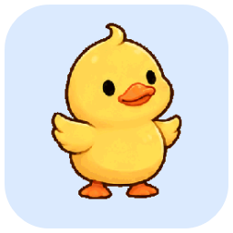
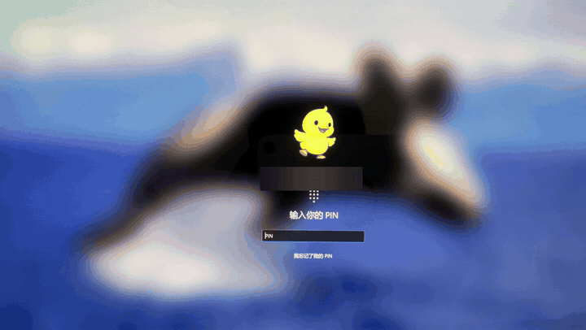
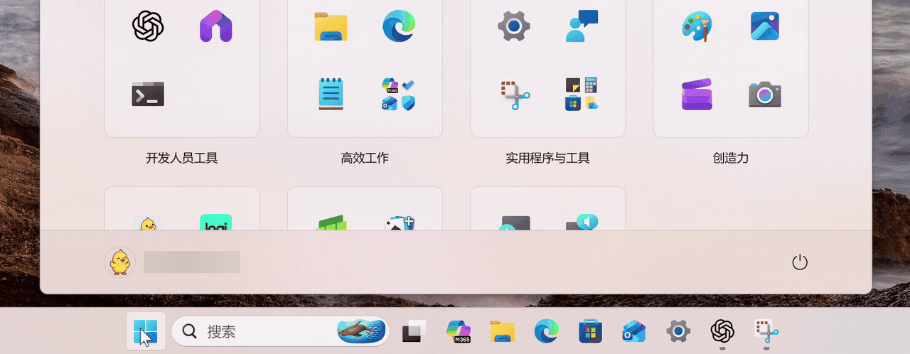
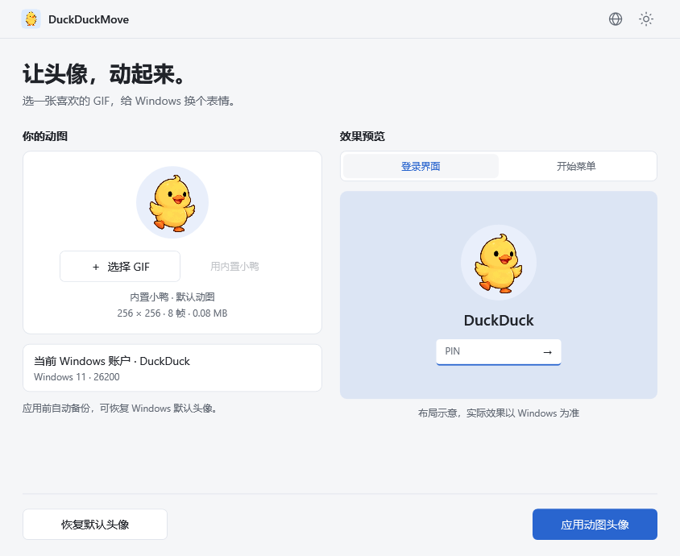
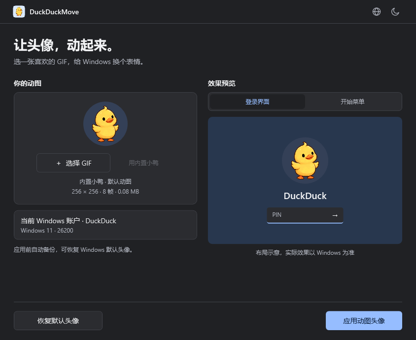
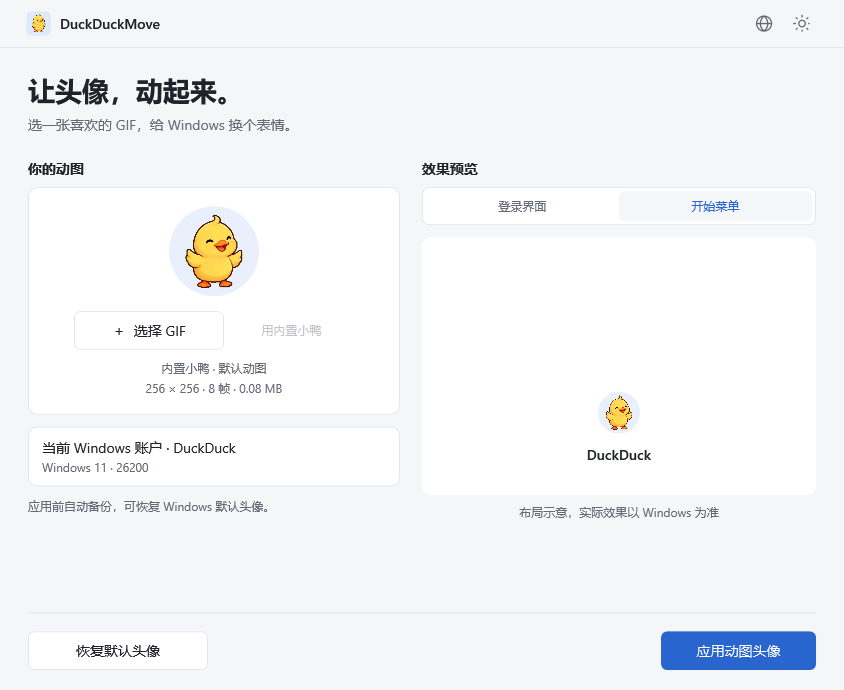

# DuckDuckMove

[English](README.md) · [简体中文](README.zh-CN.md) · [繁體中文](README.zh-TW.md) · [日本語](README.ja.md) · [Español](README.es.md) · [Português](README.pt.md)

<p align="center"></p>

<p align="center"><strong>让头像，动起来。</strong><br>Windows 11 动图头像工具 · 内置小鸭 GIF · 本地处理 · 可恢复</p>

<p align="center"><a href="https://github.com/wooi/DuckDuckMove/releases">下载 Release</a> · <a href="#界面预览">界面预览</a> · <a href="#使用">使用说明</a> · <a href="https://github.com/wooi/DuckDuckMove/issues">反馈问题</a></p>

## 下载

当前发布版本为 **v0.1.3 测试版**，包含应用或恢复后的自动刷新，以及六种界面语言。底部头像即时刷新效果仍需实机验证，Microsoft 账户卡片暂不支持同步。详见 [刷新机制与验证范围](docs/START-MENU.md)。

前往 **[Release 下载页面](https://github.com/wooi/DuckDuckMove/releases)**，在版本下方的 **Assets** 中选择：

| 版本 | 文件 | 使用方式 |
| --- | --- | --- |
| 安装版 | `DuckDuckMove-0.1.3-x64.msi` | 双击安装，从开始菜单启动；可选桌面快捷方式，支持系统卸载 |
| 免安装版 | `DuckDuckMove-0.1.3-win-x64.zip` | 解压后双击 `DuckDuckMove.exe` |

两种版本功能相同，均自带 .NET 运行时。需要 **Windows 11 x64**，应用和恢复头像时需要管理员授权。ZIP 中的程序无需安装，但应用头像仍会把素材和备份保存到系统数据目录。

**公开下载目前为 v0.1.3 测试版，尚未进行代码签名。不同账户和 Windows 版本的兼容性仍待验证。** 请阅读下方兼容性与验证状态；软件中的预览不代表 Windows 已应用成功。GitHub 自动生成的 Source code 压缩包是源码，不是可运行程序。

## 实际效果

以下为真实 Windows 效果，用户名已模糊处理。锁屏／登录界面由手机拍摄，开始菜单由系统录屏。仅展示这台电脑上的效果，不代表所有 Windows 版本或 Microsoft 账户卡片均支持。

### 锁屏／登录界面



### 开始菜单



## 界面预览

以下截图由实际 WPF 应用的演示模式渲染，右侧为布局示意，不是 Windows 登录画面的实机截图。



<details>
<summary>查看深色界面和开始菜单布局</summary>





</details>

### 内置小鸭


不选图片也能使用：启动后自动载入小鸭，点击应用即可。支持自选或拖入 GIF、浅色 / 深色主题、恢复 Windows 默认头像。

## 使用

右上角地球图标可选择 **简体中文、繁體中文、English、日本語、Español、Português**。默认跟随 Windows 显示语言；手动选择后保存偏好，立即切换，无需重启。不支持的系统语言回退到英语。详见 [语言说明](docs/LANGUAGES.md)。

1. 双击 `DuckDuckMove.exe`，无需安装 .NET。
2. 软件自动载入内置小鸭 GIF，可直接应用；也可选择或拖入自己的 GIF，在右侧查看登录界面 / 开始菜单的布局示意。
3. 点击 **应用动图头像**，在 Windows 管理员授权窗口确认操作。
4. 软件备份原头像、保存 GIF 并修改本机账户头像配置。完成后，在开始菜单或手动锁屏后查看实际效果。

选择自己的图片后，可点击 **用内置小鸭** 切回。内置 GIF 保存在 EXE 内，无需旁边附带图片文件。也提供独立的 `samples/duckduckmove-duck.gif`。

程序图标取自动图第一帧，搭配浅蓝色圆角方形背景，包含 16–256 像素的多尺寸 ICO。背景只用于图标，头像 GIF 仍为透明背景。

**恢复默认头像**：换回本机 Windows 自带的默认人形头像。

原头像备份仍会保留，用于操作失败后的恢复；当前界面仅提供恢复 Windows 默认头像。

底部仅保留「恢复默认头像」和「应用动图头像」。操作进度、结果或错误出现时再显示状态。

应用或恢复时可能每次都需要 UAC 确认。软件不会自动注销、重启或锁定电脑。设置完成后可关闭程序，临时服务会退出并被移除。

v0.1.2 在应用或恢复成功后自动刷新开始菜单，无需额外操作。开始菜单会短暂关闭，再次打开即可查看底部头像。刷新失败不撤销已写入的头像，也不代表账户卡片会更新。

## 首版边界

- 支持 Windows 11 x64；其他架构未打包验证。
- 仅处理当前 Windows 账户，不修改云端微软账户头像。
- GIF 最大 20 MB、宽高不超过 2048 像素、最多 500 帧，且总逻辑帧像素不超过 1.2 亿。非动画、损坏和过大的 GIF 会被拒绝。
- 预览按圆形裁切显示，首版不重编码或裁剪源 GIF，Windows 最终呈现可能不同。
- 这是对 Windows 头像注册表配置的封装，不是微软保证兼容的动态头像 API。系统更新、账户同步或系统设置重新选头像可能覆盖配置。
- 程序读回核对成功表示配置已写入，不代表每个系统界面都已经播放动画。
- 企业策略强制默认头像时，应用动图会被阻止。

## 数据与权限

本机数据保存在 `%ProgramData%\DuckDuckMove`：账户图片、首次备份、失败恢复记录、操作结果和辅助程序。GIF 不上传。预览副本位于当前用户的 `%LocalAppData%\DuckDuckMove\Preview`，正常关闭时清理。

界面使用普通权限。写入时，UAC 辅助进程把独立 EXE 放入受保护目录，再创建一次性 SYSTEM 服务。服务只处理限定头像操作，修改当前发起用户的头像值；不会修改注册表权限。

原头像备份与已保存素材会保留。仅删除 EXE 不会移除已设置的头像。若要清理所有数据，请先恢复默认头像，再由管理员删除本软件自己的数据目录。

## 验证状态

- v0.1.1 已通过：MSI 静默安装与卸载、安装文件校验、开始菜单快捷方式检查，以及安装后的应用界面测试；后续安装包尚未完成同等实机验证。
- 已通过：21 项核心测试（原始备份保留、缺失键处理、默认恢复、部分写入失败、回滚失败后的恢复、读回核对、无效 GIF 等）。
- 已通过：自包含 EXE 的隐藏界面测试，验证 GIF 像素随时间变化、按钮启用、默认头像预览及重新应用预览。
- 已检查：浅色、深色和开始菜单布局。
- 已通过：六种语言的菜单切换、系统语言匹配、偏好保存与损坏配置回退测试。
- 用户实机反馈：锁屏头像会更新，开始菜单底部头像在重启后更新，Microsoft 账户卡片重启后仍未改变。这不代表所有账户和系统版本均兼容。
- **仍待验证：自动刷新后的实际显示、纯本地账户和不同 Windows 版本的完整操作流程。** 隐藏界面测试不执行真实头像写入。

## 开发

在 Windows 上使用 .NET 10 SDK 和 PowerShell 7：

```powershell
# 测试、构建免安装 ZIP
./tools/build.ps1

# 基于发布目录生成 MSI，无需额外安装打包工具
./tools/build-msi.ps1
```

也可分别执行：

```powershell
dotnet run --project tests/DuckDuckMove.Tests/DuckDuckMove.Tests.csproj -c Release
dotnet publish src/DuckDuckMove.App/DuckDuckMove.App.csproj -c Release -r win-x64 -o dist/win-x64
```

系统操作需运行发布后的独立 EXE，调试目录中的多文件构建仅用于界面开发。

```powershell
# 只演示界面，不修改系统
.\dist\win-x64\DuckDuckMove.exe --demo

# 隐藏窗口渲染和 GIF 交互测试，不更改账户头像
.\dist\win-x64\DuckDuckMove.exe --render artifacts/ui samples/orbit.gif
```

`tools/create-demo.py` 使用 Pillow 生成透明圆点测试动画和旧版占位图标；正式小鸭素材由 imagegen 生成，再由 `tools/SpriteToGif` 编码为 GIF，`tools/DuckIcon` 从 GIF 第一帧生成正式图标。素材生成提示词见 `samples/source/image-prompt.md`。

## 依赖与资料

- .NET 10 / WPF、System.ServiceProcess.ServiceController：MIT 等许可证，见 `third-party`。
- XamlAnimatedGif 2.3.2：Apache-2.0，作者 Thomas Levesque，https://github.com/XamlAnimatedGif/XamlAnimatedGif

完整的依赖许可证随发行包提供。

## 灵感与致谢

DuckDuckMove 的实现思路参考了克莱德在少数派发表的 [《一日一技｜我的 Windows 11 头像会动，你也可以》](https://sspai.com/post/114312)。该文注明，选题灵感来自 [@Patrosi73](https://x.com/Patrosi73) 的 [推文](https://x.com/Patrosi73/status/2096652760494088376)，并在此基础上补充了工具配置细节。

感谢 @Patrosi73 的分享，以及克莱德和少数派的教程。DuckDuckMove 将相关操作封装为图形界面，并加入备份、恢复系统默认头像、自动刷新和多语言支持。

## 卸载

安装版可在 Windows「设置 → 应用 → 安装的应用」中卸载；免安装版可删除解压目录。两种方式都会保留已设置的头像素材和备份，避免头像路径失效。如果要恢复 Windows 头像，请在卸载前使用软件的恢复按钮。

## 贡献与许可

欢迎通过 Issues 提交 Windows 版本、复现步骤和错误提示；请勿上传含账户 SID、个人路径等隐私信息的完整日志。实现说明见 [架构文档](docs/ARCHITECTURE.md)。

项目源码采用 [MIT License](LICENSE)。第三方组件遵循各自许可证。内置小鸭素材由 AI 生成，生成提示词及处理过程见 [素材说明](samples/source/image-prompt.md)。
