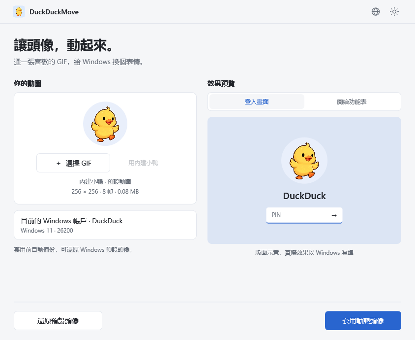
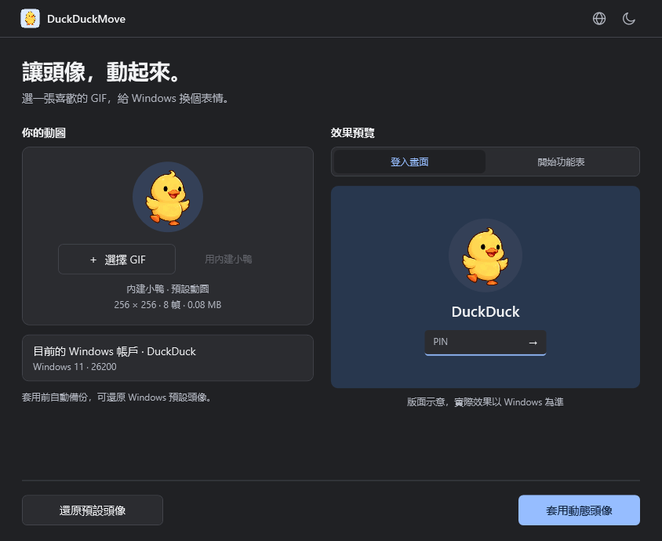
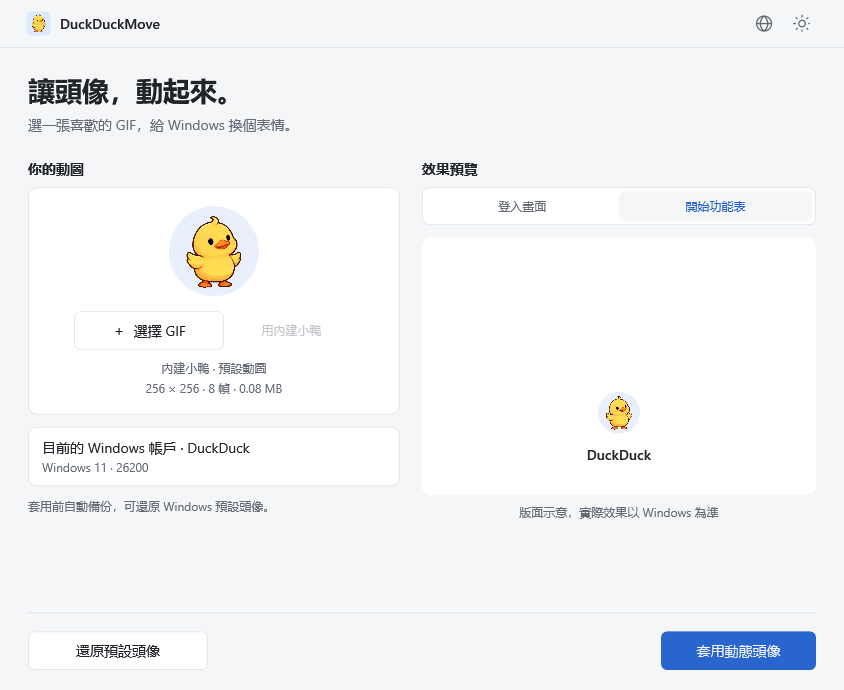

# DuckDuckMove

[English](README.md) · [简体中文](README.zh-CN.md) · [繁體中文](README.zh-TW.md) · [日本語](README.ja.md) · [Español](README.es.md) · [Português](README.pt.md)

<p align="center"></p>

**讓頭像，動起來。** Windows 11 動態頭像工具，內建小鴨 GIF、本機處理、支援還原 Windows 預設頭像。

[下載 Release](https://github.com/wooi/DuckDuckMove/releases) · [回報問題](https://github.com/wooi/DuckDuckMove/issues)

## 下載

目前原始碼為 **v0.1.3 多語言測試版**，包含六種介面語言，以及套用或還原後自動重新載入開始功能表。公開的 **v0.1.1 測試版尚未包含這些改進**。Microsoft 帳戶卡片暫不支援同步，詳見 [重新整理機制](docs/START-MENU.md)。

到 Release 頁面的 **Assets** 選擇：

| 版本 | 檔案 | 使用方式 |
| --- | --- | --- |
| 安裝版 | `DuckDuckMove-0.1.1-x64.msi` | 安裝後由開始功能表啟動，可選桌面捷徑，支援系統解除安裝 |
| 免安裝版 | `DuckDuckMove-0.1.1-win-x64.zip` | 解壓縮後執行 `DuckDuckMove.exe` |

兩種版本皆需要 **Windows 11 x64**，已包含 .NET 執行階段。套用或還原需管理員授權；免安裝版也會將素材與備份儲存到系統資料目錄。發行檔案尚未簽署程式碼，不同帳戶和 Windows 版本的相容性仍待驗證。GitHub 的 **Source code** 壓縮檔是原始碼，不是可執行程式。

## 介面預覽

截圖由實際 WPF 應用程式的示範模式產生，右側是版面示意，不是 Windows 登入畫面的實機截圖。以下截圖為繁體中文介面。



<details><summary>深色介面與開始功能表版面</summary>




</details>


## 使用

1. 執行 `DuckDuckMove.exe`，不必另裝 .NET。
2. 直接使用內建小鴨，或選擇、拖入自己的 GIF，查看登入畫面或開始功能表的版面示意。
3. 按 **套用動態頭像**，確認 Windows 管理員授權。
4. 程式備份原頭像、儲存 GIF 並變更目前使用者的本機頭像設定，再到 Windows 查看實際效果。

按 **用內建小鴨** 可切回預設動圖。GIF 已內嵌於 EXE，也提供獨立的 `samples/duckduckmove-duck.gif`。程式圖示取自第一幀，搭配淺藍色圓角方形背景，包含 16–256 像素 ICO；頭像 GIF 本身仍為透明背景。

右上角的 **地球圖示** 可選擇簡體中文、繁體中文、English、日本語、Español、Português。預設跟隨 Windows 顯示語言；手動選擇後立即生效並記住設定，不支援的系統語言回退至英語。詳見 [語言說明](docs/LANGUAGES.md)。Windows 授權視窗與系統診斷原文仍依 Windows 設定顯示，MSI 安裝精靈目前仍為簡體中文。

**還原預設頭像** 會換回 Windows 預設人形圖示。介面僅提供此還原方式；原頭像備份仍保留，用於操作失敗後的復原。底部只顯示還原與套用按鈕，操作中、完成或失敗時才顯示狀態。

自 v0.1.2 起，套用或還原成功後會自動重新載入開始功能表，功能表可能短暫關閉。重新載入失敗不撤銷已儲存的頭像，也不表示 Microsoft 帳戶卡片會更新。程式不會自動登出、重新開機或鎖定電腦；完成後可關閉，暫時服務會結束並移除。

## 限制、資料與權限

- 僅修改目前 Windows 使用者的本機頭像，不修改雲端 Microsoft 帳戶頭像；其他架構尚未打包驗證。
- GIF 上限為 20 MB、寬高 2048 像素、500 幀、總邏輯幀像素 1.2 億。靜態、損毀或過大的檔案會被拒絕。
- 預覽使用圓形裁切，不會重新編碼或裁切來源 GIF；Windows 實際顯示可能不同。
- 本工具修改 Windows 頭像登錄設定，並非微軟保證相容的動態頭像 API。系統更新、帳戶同步或重新選取頭像可能覆蓋設定。讀回驗證成功不等於所有位置都播放動畫。組織原則強制預設頭像時會阻止套用。

素材、首次備份、復原記錄、操作結果和輔助程式儲存在 `%ProgramData%\DuckDuckMove`，GIF 不會上傳。`%LocalAppData%\DuckDuckMove\Preview` 的預覽副本會在正常關閉時清理；語言偏好位於 `%LocalAppData%\DuckDuckMove\preferences.json`。

介面使用一般權限；寫入時，提權輔助程式將獨立 EXE 複製到受保護目錄，再建立一次性 SYSTEM 服務，僅處理發起使用者的限定頭像操作，不修改登錄權限。

## 驗證狀態

已通過 21 項核心測試，涵蓋備份保留、缺少登錄鍵、預設還原、回復、復原、讀回驗證與無效 GIF。隱藏介面測試涵蓋動畫、操作、六種語言切換、系統語言匹配、偏好保存與損毀設定回退；已檢查淺色、深色和開始功能表版面。

v0.1.1 MSI 已通過靜默安裝與解除安裝、檔案與捷徑檢查，以及安裝後的介面測試；後續安裝包尚未完成同等實機驗證。使用者回報鎖定畫面會更新、開始功能表底部頭像重新開機後更新，但 Microsoft 帳戶卡片不變。**自動重新整理的實際顯示、純本機帳戶，以及不同 Windows 版本的完整流程仍待驗證。** 隱藏介面測試不修改真實頭像。

## 開發

使用 Windows、.NET 10 SDK 與 PowerShell 7：

```powershell
./tools/build.ps1
./tools/build-msi.ps1
```

第一個指令執行測試並產生免安裝 ZIP，第二個以 Windows 工具產生 MSI。也可個別執行：

```powershell
dotnet run --project tests/DuckDuckMove.Tests/DuckDuckMove.Tests.csproj -c Release
dotnet publish src/DuckDuckMove.App/DuckDuckMove.App.csproj -c Release -r win-x64 -o dist/win-x64
.\dist\win-x64\DuckDuckMove.exe --demo
.\dist\win-x64\DuckDuckMove.exe --render artifacts/ui samples/orbit.gif
```

系統操作需使用發佈後的獨立 EXE，多檔案偵錯版本僅供介面開發。`tools/create-demo.py` 產生舊版佔位素材；小鴨由 AI 產生，再由 `tools/SpriteToGif` 編碼，並由 `tools/DuckIcon` 製作圖示。詳見 [素材提示詞與流程](samples/source/image-prompt.md)。

## 靈感與致謝

實作參考克莱德於少數派發表的 [《一日一技｜我的 Windows 11 头像会动，你也可以》](https://sspai.com/post/114312)。該文註明選題靈感來自 [@Patrosi73](https://x.com/Patrosi73) 的 [貼文](https://x.com/Patrosi73/status/2096652760494088376)，並補充工具設定細節。感謝 Patrosi73、克莱德與少數派。DuckDuckMove 將操作封裝為圖形介面，加入備份、還原預設頭像、自動重新載入與多語言功能。

## 解除安裝、貢獻與授權

安裝版可由 Windows「設定 → 應用程式 → 已安裝的應用程式」移除；免安裝版可刪除解壓縮目錄。素材與備份會保留，避免頭像路徑失效。如需還原，請先在程式內還原預設頭像；若要清除所有資料，還原後再由管理員僅刪除本程式的資料目錄。

歡迎在 Issues 提供 Windows 版本、重現步驟與錯誤訊息，請勿上傳含帳戶 SID 或私人路徑的完整記錄。詳見 [架構文件](docs/ARCHITECTURE.md)。

原始碼採用 [MIT](LICENSE)。.NET/WPF、System.ServiceProcess.ServiceController 的授權聲明見 [third-party](third-party)。Thomas Levesque 的 [XamlAnimatedGif](https://github.com/XamlAnimatedGif/XamlAnimatedGif) 2.3.2 採用 Apache-2.0。第三方授權隨發行包提供；內建小鴨為 AI 產生素材。
